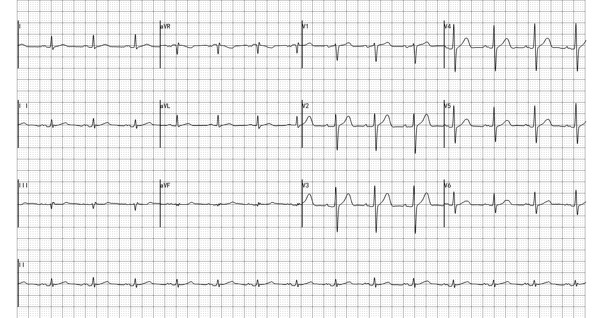
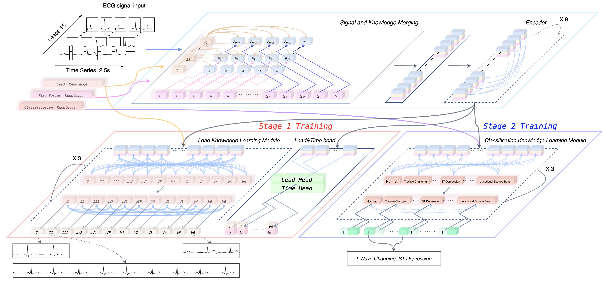
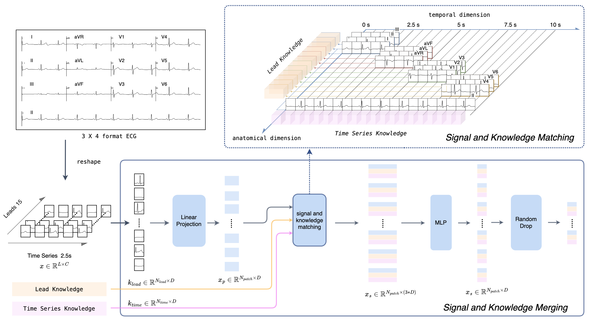

# [A knowledge-based network for complete ECG classification in the clinical $3 \times 4$ format]()
This repository is a codebase for ECG classification networks, which is used in our paper ["A knowledge-based network for complete ECG classification in the clinical $3 \times 4$ format"](). In this paper, we propose a multilabel ECG knowledge-based network (EKnet) to detect a wide range of classifications in the clinical $3 \times 4$ ECG format. 

##### ECG $3 \times 4$ format
 


##### Overall architecture 
 


##### Signal knowledge embedding module
 

## The Purpose of This Project
Recently, automatic abnormal electrocardiography (ECG) detection has achieved significant progress through the implementation of deep learning networks. These studies were developed under limited numbers of categories and mostly assumed 12 leads over 10 seconds as inputs. However, in most clinical environments, over 100 classifications must be interpreted in the $3 \times 4$ ECG format, which involves 2.5 seconds of 12 leads and one 10-second II lead. To fill these gaps, we propose a multilabel ECG knowledge-based network (EKnet) to detect a wide range of classifications in the clinical $3 \times 4$ ECG format. EKnet automatically learns three kinds of knowledge, namely, lead, time series and classification knowledge, via a 2-stage knowledge learning mechanism. The spatial and temporal representations of ECG signal features are merged with the lead and time series knowledge under a position-based merging mechanism. Every classification is predicted based on the corresponding knowledge, and this classification knowledge captures the attention from signal features and discovers the dependencies with other classification knowledge through a knowledge learning module. We demonstrate that our EKnet significantly outperforms previous networks on two datasets with rich classifications. Moreover, we prove that EKnet exhibits high interpretability and can provide the exclusive attention of each classification.

## How to train:
### Installation
We suggest the python 3.8 environments with the following package:
+ torch>=1.9.0;
+ torchvision>=0.8.0; 

very simple, that's it!


### Data Preparation
We using PTB-XL dataset to demonstrate the data preparation, 

#### 1. prepare the config files:
 `configs/EKnet_self_learning.yaml` or `configs/EKnet_classification.yaml`

following files is generated from [ECG dataset translation](https://github.com/caoqing-ruijing/ECG_dataset_translation)
```
DATASET:
  TRAIN_CSV: "dataset/PTB_XL_data/k0_train.csv"
  VAL_CSV: "dataset/PTB_XL_data/k0_val.csv"
  STATS_CSV: "dataset/PTB_XL_data/k0_distribution.csv"
  DATA_DIR: "dataset/PTB_XL_data/PTB_orginal_jsonzip_ecgzip/"
  MODEL_SAVE_DIR: "model_outputs/"
```

#### 2. two stage training 

##### 2.1 first stage training 
start the first stage self learning trainig and get the trained model path:
```
python3 train_self_learning_EKPnet.py --config configs/EKnet_self_learning.yaml
```
output validation results is output every 5 epcoh:
```
===> using GPU [0] 
===> model_outputs/ETE_Aug_23_full110w_e300_750_cross_atten_1e_2022_09_01-21_41/train_cfg.yaml saved
===> Loading datasets done
===> model done
------------------------------------------------------------------
Epoch: 0	Time: 620.1963s 	 train Loss: 0.110545 val loss: 0.041366 LearningRate 0.00002667
------------------------------------------------------------------
...
------------------------------------------------------------------
Epoch: 295	Time: 599.1517s 	 train Loss: 0.001822 val loss: 0.002029 LearningRate 0.00000114
------------------------------------------------------------------
------------------------------------------------------------------
Epoch: 299	Time: 591.6892s 	 train Loss: 0.001823 val loss: 0.002022 LearningRate 0.00000100
------------------------------------------------------------------
Training complete in 2843m 0s
```

##### 2.2 second stage training 
set the pertrained model path in `configs/EKnet_classification.yaml` from stage 1:
```
Pertrain_Path: "./.../model.pth"
Using_Pertrain: True
```

start the second stage classification training:
```
python3 train_self_learning_EKPnet.py --config configs/EKnet_self_learning.yaml
```
output

```
===> using GPU [0] 
===> Loading datasets done
===> model done

------------------------------------------------------------------
Epoch: 1	Time: 8.9940s 	 train_Loss: 1.685883 train_acc: 64.8172  val_loss: 0.708077  val_acc: 31.155779  	 LearningRate 0.00010000
------------------------------------------------------------------
Epoch: 2	Time: 6.3529s 	 train_Loss: 0.685477 train_acc: 60.3405  val_loss: 0.563852  val_acc: 74.874372  	 LearningRate 0.00015000
------------------------------------------------------------------
...

Epoch: 50	Time: 9.1216s 	 train_Loss: 0.049881 train_acc: 98.3737  val_loss: 1.411403  val_acc: 76.821192  	 LearningRate 0.00000100
------------------------------------------------------------------
```


### Results
|               | **RJ-ECG**   |       | **PTB-XL**   |       |
|-----------------------|--------------|---------------|--------------|---------------|
| **Methods**           | **macro F1 (%)** | **macro AUC (%)** | **macro F1 (%)** | **macro AUC (%)** |
| **fcn_wang**          | 22.57±0.56   | 93.68±0.07    | 21.64±0.67   | 84.06±0.06    |
| **resnet1d_wang**    | 23.97±0.70   | 94.47±0.06    | 22.43±0.59   | 83.7±0.05     |
| **InceptionTime**    | 24.17±0.87   | 93.84±0.06    | 22.25±0.68   | 86.12±0.05    |
| **xresnets101**       | 23.63±0.66   | 94.19±0.08    | 22.20±0.60   | 87.39±0.07    |
| **LSTM**              | 22.12±0.51   | 92.64±0.07    | 20.11±0.87   | 87.17±0.6     |
| **LSTM_bidir**        | 22.59±0.83   | 93.68±0.05    | 20.98±0.51   | 85.17±0.05    |
| **Resnet34**          | 23.38±0.73   | 94.19±0.07    | 21.77±0.63   | 87.34±0.06    |
| **Resnet33+NCBAM**    | 24.93±0.53   | 94.93±0.06    | 22.20±0.81   | 87.39±0.07    |
| **MLBF-Net**         | 25.42±0.49   | 95.10±0.07    | 22.50±0.52   | 87.50±0.08    |
| **EKnet w/o stage 1** | 34.35±0.41   | 96.52±0.03    | 25.23±0.58   | 88.37±0.05    |
| **EKnet**            | 39.12±0.56   | 97.61±0.04    | 29.24±0.59   | 89.74±0.04    |
